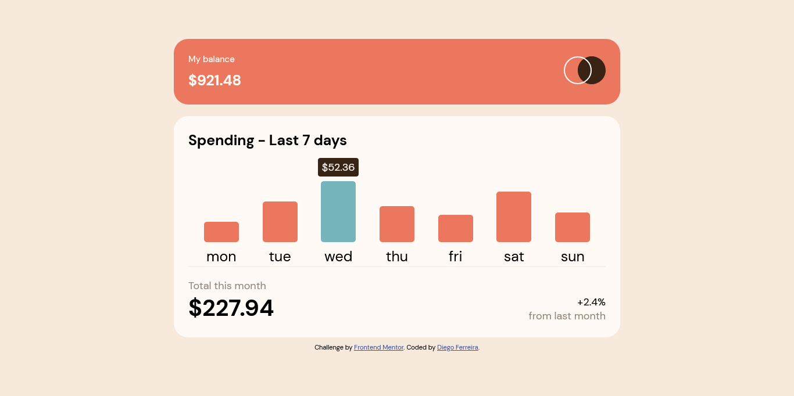

# Frontend Mentor - Expenses chart component

## Bem-vindo! 👋

Obrigado por verificar este desafio de codificação de front-end.

Esta é uma solução para o [Frontend Mentor - Expenses chart component] (https://www.frontendmentor.io/challenges/expenses-chart-component-e7yJBUdjwt). Os desafios do Frontend Mentor ajudam a melhorar suas habilidades de codificação através da construção de projetos realistas.

## Tabela de conteúdo

- [Visão geral](#visão-geral)
  - [O Desafio](#o-desafio)
  - [Screenshot](#screenshot)
  - [Links](#links)
- [Meu processo](#meu-processo)
  - [Construído com](#construído-com)
  - [O que aprendi](#o-que-eu-aprendi)
- [Autor](#autor)

## Visão geral

### O desafio

Os usuários devem ser capazes de fazê-lo:

- Visualizar o gráfico de barras e pairar sobre as barras individuais para ver as quantidades corretas para cada dia
- Ver a barra do dia atual destacada em uma cor diferente das outras barras
- Ver o layout ideal para o conteúdo dependendo do tamanho da tela de seu dispositivo
- Ver os estados para todos os elementos interativos na página
- Bonus\*\*\*: Usar o arquivo de dados JSON fornecido para dimensionar dinamicamente as barras no gráfico

### Screenshot

#### Links

- URL da solução: https://github.com/DiegoFerrib/fem-expenses-chart-component
- URL do site ao vivo: https://expenses-chart-component-rust-eta.vercel.app/

## Meu processo

#### Construído com

- Vite
- HTML5
- CSS
- Vanilla JS

### O que eu aprendi

- Melhor manipular arquivos JSON importados no JavaScript
- Criar gráficos dinâmicos com base em um JSON

## Autor

- GitHub - https://github.com/diegoferrib
- Frontend Mentor - https://www.frontendmentor.io/profile/DiegoFerrib
